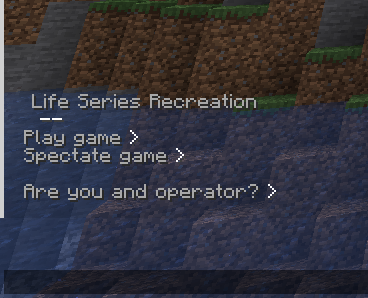

# Life Series Recreation

This is my custom version of the 3rd Life series and the Last Life series by Grian. This is NOT a one-to-one recreation, but rather a fusion of both series.

## Rules

These explanations have been adapted from the [Life Series Wiki](https://the-life-series.fandom.com/wiki/3rd_Life#Rules).

### The Life System

- Each player starts with three lives. Their name is green and they cannot kill other players unless in self-defence.
- If a player dies, they lose a life. Their name becomes yellow, and the same rules apply.
- When a player reaches their final life, their name becomes red, and they will become hostile to other players. All alliances are severed when you reach your Last Life.
- Red names get a temporary buff to absorption, regeneration and fire resistance after performing a kill.

### The Boogeyman

- This is one or more players chosen at the beginning of each session.
- The server does not reveal who the Boogeyman is except to the Boogeyman themselves.
- They become hostile and have to kill 1 green or yellow person to be cured.
- If not cured by the end of the session, they get put down to 1 life for the next session.
- The Boogeyman also gets a temporary buff to absorption, regeneration and fire resistance after performing the kill.

## Features

- Some crafting recipes have been changed or added:
  - TNT is now crafted with 4 paper and 1 gunpowder instead of 5 gunpowder.
  
    
  
  - Name tags are now craftable with paper and string.
  
    
  
  - Saddles are now craftable with 3 leather.
  
    
  
- There are sounds for the Boogeyman being chosen.
- The Boogeyman is automatically cured if they reach their Last Life, or when there are no other green or yellow names.

## Commands and Settings

When a player joins, as shown in the image, a menu opens in chat that allows them to choose between playing the game or spectating it.

If you are an operator, you have to press the "Are you an operator?" button to get the corresponding permissions.

This data pack requires of an administrator to run the following commands to trigger different events. This commands can be instead accessed from the Main Menu, which can be opened using the command `/trigger lsr.menu`.

You can configure the game by pressing the "Settings" button or running `/trigger lsr.settings`. This will pop up a menu with all available settings.

Operators can also use commands to manage the data pack. This is a simple list of all the available operator commands:

| Command | Description |
| ---- | ---- |
| `/trigger lsr.start_game` | Starts the game. |
| `/trigger lsr.start_session` | Starts the session. This will send a message to all the players saying that the session has started and it will punish Boogeymen that did not kill a player last session. |
| `/trigger lsr.choose_boogeyman` | Chooses the Boogeyman. Can be run multiple times for multiple Boogeymen.
| `/execute as <PLAYER NAME> run function lsr:boogeyman/cure` | Cures `<PLAYER NAME>` if they are a Boogeyman. |

## Translation support

There are a total of 9 languages available in LSR
 - Catalan
 - Czech
 - Dutch
 - English
 - French
 - Spanish
 - LOLCAT
 - Pirate Speak
 - Shakespearean English

## Bug reports, feature suggestions, and languages

You can report bugs and suggest features in the [GitHub repository](https://github.com/LluisJM/Life-Series/issues).

If you would like to help translating to a language that has not yet been implemented, DM me!

## Credits

Thanks to RonoCZ, manatedough and Ondranik for helping with play-testing the data pack, and thank you, for translating to various languages, to gerritdebal (Dutch) and Noukum (French and Shakespearean English) and also manatedough (French and LOLCAT) and Ondranik (Czech and Pirate Speak)!

Recipe images have been generated using [this website](https://crafting.thedestruc7i0n.ca/) by [TheDestruc7i0n](https://thedestruc7i0n.ca/).
